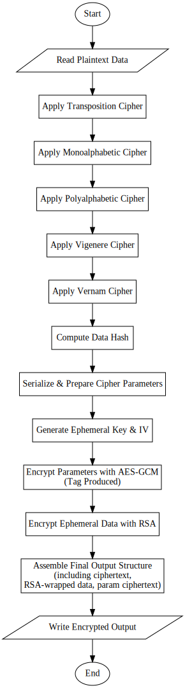
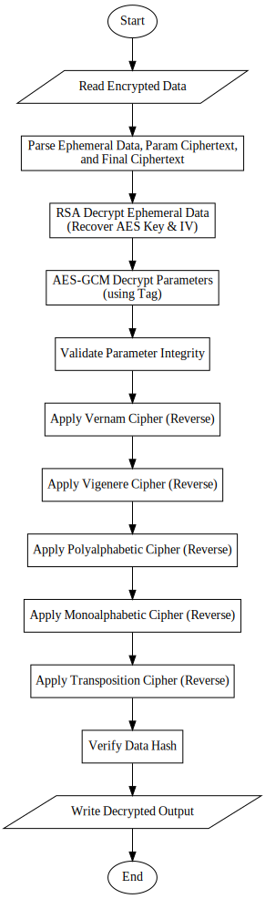

# Cipher Nexus

**Cipher Nexus** is a layered encryption/decryption toolkit that combines classical cryptographic ciphers (such as Transposition, Monoalphabetic, Polyalphabetic, Vernam, and Vigenere) with modern RSA + AES-GCM hybrid encryption. The project offers both a Python command-line interface and a Tkinter-based GUI for convenient use.

---

## Table of Contents

1. [Overview](#overview)
2. [Features](#features)
3. [Architecture](#architecture)
   - [Directory Structure](#directory-structure)
   - [Flowcharts](#flowcharts)
4. [Installation](#installation)
5. [Usage](#usage)
   - [Command-Line](#command-line)
   - [GUI](#gui)
   - [Tests](#tests)
6. [Additional Details](#additional-details)
   - [Classical Cipher Layers](#classical-cipher-layers)
   - [Hybrid Crypto](#hybrid-crypto)
   - [RSA Key Management](#rsa-key-management)

---

## Overview

Cipher Nexus provides:

- Multiple classical ciphers layered for encryption:
  1. **Transposition Cipher**  
  2. **Monoalphabetic Cipher**  
  3. **Polyalphabetic Cipher**  
  4. **Vigenere Cipher**  
  5. **Vernam Cipher**  

- Hybrid encryption of cipher parameters:
  - **RSA** for asymmetric key wrapping.
  - **AES-GCM** for encrypting the parameters.

- An optional **GUI** (Tkinter-based) to select input files, output paths, and keys with minimal fuss.

---

## Features

- **Layered Classical Encryption**: Demonstrates how multiple classical ciphers can be combined.
- **RSA + AES-GCM Hybrid**: Ensures secure key exchange for the classical parameters and data integrity via AES-GCM tags.
- **In-Memory and File-Level Operations**: Encrypt or decrypt data directly in memory or process entire files.
- **Test Suite**: Extensive tests covering unit, integration, and end-to-end scenarios.

---

## Architecture

Cipher Nexus consists of several Python modules, each focusing on one area of functionality:

| Module Path               | Responsibility                                      |
|---------------------------|-----------------------------------------------------|
| `src/ciphers/*`           | Classical cipher implementations.                   |
| `src/crypto/*`            | Modern crypto (RSA, AES-GCM, hashing).             |
| `src/pipeline/*`          | High-level coordination of classical and hybrid steps. |
| `src/utils/*`             | Common utilities, file I/O helpers, and constants. |
| `src/gui.py`              | Tkinter-based GUI implementation.                  |
| `src/main.py`             | Main entry point for command-line usage.           |

### Directory Structure

A brief look at the repository layout:

```

Cipher-Nexus/
├── src/
│   ├── ciphers/
│   │   ├── _stream_cipher_utils.py
│   │   ├── cipher_base.py
│   │   ├── monoalphabetic.py
│   │   ├── polyalphabetic.py
│   │   ├── transposition.py
│   │   ├── vernam.py
│   │   └── vigenere.py
│   ├── crypto/
│   │   ├── hashing.py
│   │   ├── hybrid.py
│   │   └── rsa_manager.py
│   ├── pipeline/
│   │   ├── classical.py
│   │   └── io.py
│   ├── utils/
│   │   ├── common.py
│   │   ├── constants.py
│   │   └── file_io.py
│   ├── gui.py
│   └── main.py
├── tests/
│   ├── helpers/
│   │   └── rsa_test_helpers.py
│   ├── test_end_to_end.py
│   ├── test_hashing.py
│   ├── test_hybrid_params.py
│   ├── test_main_cli.py
│   ├── test_monoalphabetic.py
│   ├── test_pipeline_io.py
│   ├── test_polyalphabetic.py
│   ├── test_rsa_manager.py
│   ├── test_transposition.py
│   ├── test_utils_common.py
│   ├── test_utils_file_io.py
│   ├── test_vernam.py
│   └── test_vigenere.py
└── README.md

```

### Flowcharts

Two flowcharts illustrate the end-to-end encryption and decryption processes, showing how classical and hybrid cryptography interoperate.

#### Encryption Process



1. Multiple classical ciphers are applied to the plaintext in sequence.  
2. A secure hash is computed.  
3. Cipher parameters are serialized and AES-GCM encrypted with an ephemeral key.  
4. The ephemeral key is wrapped via RSA.  
5. The final output file contains:
   - RSA-encrypted ephemeral key data
   - Cipher parameters ciphertext
   - Classical ciphertext  

#### Decryption Process



1. Parse the encrypted file, recover ephemeral key data using RSA.  
2. Decrypt cipher parameters via AES-GCM.  
3. Reverse each classical cipher in the opposite order.  
4. Verify the integrity hash.  

---

## Installation

1. **Clone** or **download** this repository.
2. Install Python (3.7+) if not already available.
3. Install required dependencies:
   ```
   pip install -r requirements.txt
   ```

If you wish to render the flowcharts yourself:

* Ensure [Graphviz](https://www.graphviz.org/) is installed on your system.
* Run the Python scripts in `assets/` to regenerate `.svg` files if necessary.

---

## Usage

### Command-Line

Run the `src/main.py` script with appropriate commands. For convenience, you can invoke:

```
python src/main.py <command> [options...]
```

Alternatively, from the project root:

```
python -m src.main <command> [options...]
```

#### Encrypt

```
python src/main.py encrypt <input_file> <output_file> <public_key.pem>
```

* `input_file`: The plaintext file to encrypt.
* `output_file`: The resulting ciphertext file.
* `public_key.pem`: An RSA public key used to wrap the AES-GCM ephemeral key.

#### Decrypt

```
python src/main.py decrypt <input_file> <output_file> <private_key.pem>
```

* `input_file`: The ciphertext file.
* `output_file`: The recovered plaintext file.
* `private_key.pem`: The RSA private key to unwrap the ephemeral key.

#### Generate RSA Key Pair

```
python src/main.py genkey <private_key.pem> <public_key.pem> [<key_size>]
```

* `private_key.pem`: Destination file for private key.
* `public_key.pem`: Destination file for public key.
* `key_size` (optional): Key size in bits, defaults to 2048 if omitted.

### GUI

To launch the Tkinter-based GUI, simply run:

```
python src/main.py
```

(or)

```
python -m src.main
```

If no command-line arguments are specified, Cipher Nexus starts in GUI mode.

**GUI Features**:

* Select a file to process (plaintext or ciphertext).
* Choose an output file.
* Provide a PEM key file (public key for encryption, private key for decryption).
* Generate new RSA key pairs with an optional passphrase for private key encryption.

### Tests

To run all tests:

```
python -m unittest discover tests
```

This recursively discovers and runs all tests under `tests/`. You can also run individual test files:

```
python -m unittest tests/test_polyalphabetic.py
```

---

## Additional Details

### Classical Cipher Layers

1. **Transposition Cipher**

   Rearranges bytes into columns row-by-row, then reads them column-by-column.

2. **Monoalphabetic Cipher**

   Substitutes bytes according to a 256-byte permutation.

3. **Polyalphabetic Cipher**

   Applies repeated modular addition per key byte.

4. **Vigenere Cipher**

   Shift-based classical cipher for alphabetic characters (A–Z, a–z).

5. **Vernam Cipher**

   XOR-based cipher (key repeated as necessary).

**Encryption Order**:

```
plaintext → Transposition → Monoalphabetic → Polyalphabetic → Vigenere → Vernam → ciphertext
```

**Decryption** reverses the order:

```
ciphertext → Vernam → Vigenere → Polyalphabetic → Monoalphabetic → Transposition → plaintext
```

### Hybrid Crypto

* **AES-GCM**

  Used to encrypt the serialized cipher parameters (key bytes, passphrases, etc.). Integrity is protected by the GCM tag.

* **RSA**

  Encrypts the AES key, IV, and tag. This allows securely exchanging the AES-GCM parameters without exposing them in plaintext.

### RSA Key Management

* **RSAManager**

  A utility class that generates RSA keys, encrypts/decrypts data, and handles saving/loading PEM files (optionally password-protected for private keys).

```
RSAManager:
 ├── generate_key_pair()
 ├── encrypt()
 ├── decrypt()
 ├── save_private_key()
 ├── load_private_key()
 ├── save_public_key()
 └── load_public_key()
```
